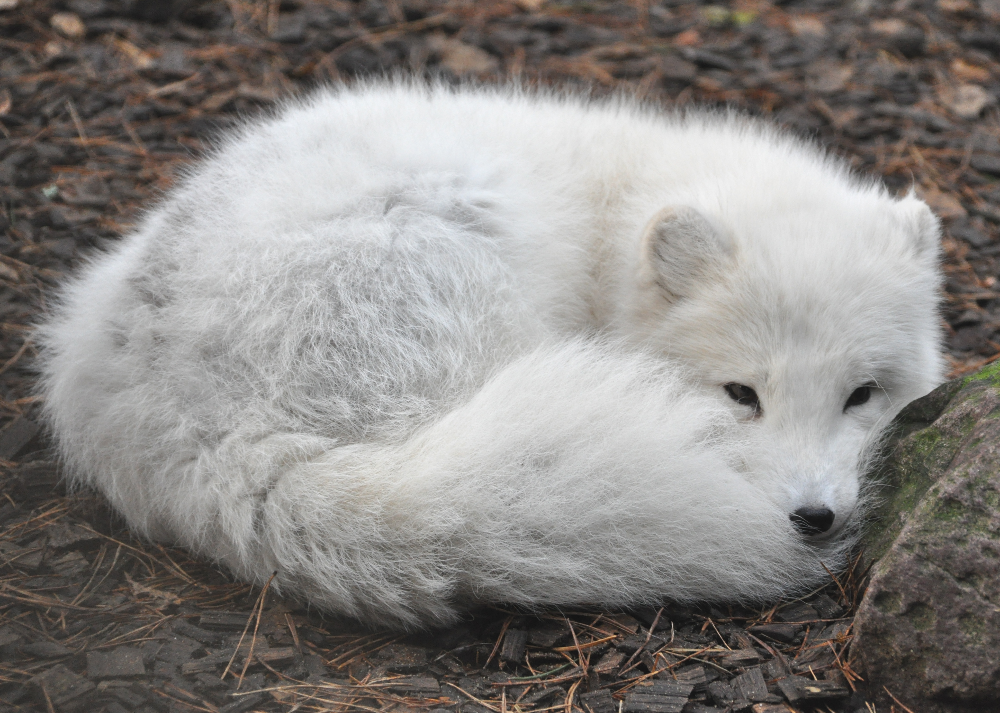

# Merkmale
Der wissenschaftliche Name bedeutet „hasenfüßiger Fuchs“, da seine Pfoten wie die des Polarhasen mit dichtem Pelz besetzt sind. Seine Gestalt weist ihn als typischen Fuchs aus, doch wirken seine Kopf- und Schnauzenform gedrungener als etwa beim Rotfuchs. Die durchschnittliche Länge misst, unter Einbeziehung des etwa 35 Zentimeter langen Schwanzes, zwischen 65 und 90 Zentimetern. Die Schulterhöhe beträgt etwa 30 Zentimeter, das Gewicht rund 5 Kilogramm. Die Fähen (Weibchen) sind nur wenig kleiner als die männlichen Tiere.

